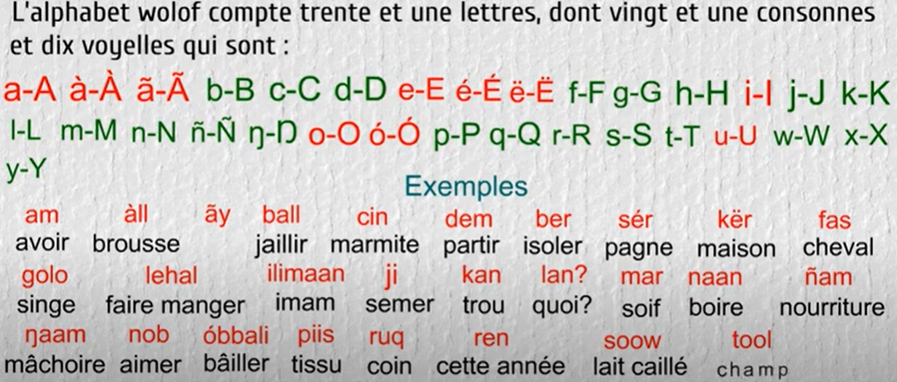

## 1. Origine du terme wolof
La question des origines du wolof et de ses liens potentiels avec l'Égypte antique s'inscrit dans un débat scientifique et historique marqué par les travaux pionniers de **Cheikh Anta Diop**. Ce dernier, intellectuel sénégalais, a développé une théorie établissant des connexions linguistiques et culturelles entre [l'Égypte pharaonique et les civilisations d'Afrique de l'Ouest](https://fr.wikipedia.org/wiki/Wolofs#Histoire). Diop affirmait que l'Égypte antique était peuplée d'Africains noirs et que la langue et la culture égyptiennes se sont ensuite diffusées en Afrique occidentale.
 
Cette théorie s'appuie notamment sur des recherches linguistiques comparatives entre le wolof et l'égyptien pharaonique, détaillées dans un **chapitre** de son ouvrage ["Parenté génétique de l'égyptien pharaonique et des langues négro-africaines"](https://www.amazon.fr/Parent%C3%A9-g%C3%A9n%C3%A9tique-lEgyptien-pharaonique-n%C3%A9gro-africaines/dp/2917400013). Cheikh Anta Diop, utilisait le mot **`waa-laf`** dans ses recherches sur l'origine des Wolofs, qui selon lui est l’ancêtre du mot **wolof** et est un terme qui révèle une dimension historique et géographique profondément ancrée dans l'identité de ce peuple ouest-africain. En wolof, **`waa-`(1)** signifie **« ceux venant de »** et **`laf`(2)** se traduit par **« rive »** ou **« berge »** formant ainsi l'expression **waa-laf** pour désigner [« ceux originaires de l'autre côté (du rive) »](https://fr.wikipedia.org/wiki/Wolofs#Ethnonymie). Cette désignation renvoie probablement aux rives du Nil, selon les hypothèses développées par Cheikh Anta Diop, qui situait l'origine des Wolofs dans la vallée du fleuve Nil. Le mot waa-laf aurait évolué phonétiquement pour devenir **wolof**, désignant à la fois le peuple et sa langue.
{ .annotate }

1. Le préfixe **waa-** est la forme plurielle de **saa-**. Ces préfixes servent à désigner les personnes originaires d'une localité.  
    - **Exemple**: 
      - **saa-**cees b-: le thiesois (**c** en wolof se lit **”thi”** [voir alphabet wolof](./2-alphabet_wolof)) ⇒ waa-cees: les thiesois
      - **saa-**senegaal b-: le sénégalais ⇒ **waa-**senegaal: Sénégalais

2. **laf**, `verbe` : signifie littéralement **poser contre**, **mettre de côté** ou **préserver**. Justement le terme **lafal** dans la phrase populaire "Yal na ko Yàlla **laf**al loolu" (Que Dieu le préserve de cela) est dérivé de **laf**.
    - **Lafu** = **`laf`** + u, `verbe`: signifie se mettre de côté, se placer latéralement.
    - **Laf b-**, `nom` = extrémité, bout [(pan de vêtement)](https://contenu.vitrinelinguistique.oqlf.gouv.qc.ca/illustrations/51314.jpg) selon le contexte.
    - Il existe une variation de ce mot qui est **lef w-** qui signifie **couloir** ou **côté** en français. 
  > On peut ainsi comprendre que **laf** pourrait bien désigner **l'autre côté (du rive)** car c'est un endroit qui est séparé, mis à l'écart du lieu où l'on se trouve. 
  
## 2. Le problème du Wolof
Le wolof est une langue largement parlée au Sénégal, en Gambie et en Mauritanie, étant la langue maternelle du peuple Wolof. Elle dépasse le statut de dialecte[^1] et a le statut de langue nationale. Compris par environ **90% de la population sénégalaise**, le Wolof sert de langue de communication interethnique et de support pour les bulletins d'information oraux. Grâce à la numérisation, le wolof pourrait également faciliter les processus administratifs via des voicebots ou des chatbots.

Outre sa fonction de langue interethnique et de véhicule d'information, le wolof possède une **tradition `séculaire`** dans l’enseignement des **sciences religieuses islamiques**, illustrant ainsi sa profonde richesse culturelle et linguistique. Malheureusement, cette richesse n’est acquise que par les **`érudits islamiques`** et les personnes qui vivent dans certaines régions du pays. Les natifs ou les sénégalais parlent la langue **sans pour autant connaître son alphabet** car en effet l’apprentissage de cette langue ne se fait qu’oralement depuis le bas âge et elle n’est **jamais enseignée** et ceci induit **une dégradation de la langue de plus en plus déconcertante**. Le wolof est ainsi sur une voie d’appauvrissement car en effet, son vocabulaire profond est inaccessible à défaut d’écriture. Aujourd'hui, la langue bénéficie de multiples **efforts de valorisation** et de **préservation**. La section suivante offre un aperçu captivant de l'évolution de l'écriture en wolof et met en lumière quelques initiatives innovantes pour la promouvoir.

## 3. Histoire et évolution du Wolof
Autour de la langue, il y a deux mondes ayant conduit à deux alphabets de la langue:

* Nous avons l’alphabet **Ajami[^2],** issu de la culture islamique du pays[^3]. L'Ajami est un ensemble d'alphabets dérivés de l'alphabet arabe, utilisé pour transcrire les langues d'Afrique de l'Ouest. Plutôt que d'introduire de nouvelles lettres, des modifications sont généralement apportées en ajoutant des points ou des lignes aux lettres existantes pour représenter des sons absents dans l'arabe standard. Ces alphabets ont été et sont encore utilisés pour la transcription des langues de la sous-région : le haoussa, le peul, le wolof, le diola, le bambara et d'autres langues mandingues. La version de l'Ajami pour le wolof est appelée le **`Wolofal`**.

!!! tip inline "Info"
    Le **wolofal** est surtout utilisé par ceux qui ont fréquenté les écoles coraniques, notamment dans le commerce.
    Il existe peut-être des livres en wolof écrits en ajami, mais je n'en connais pas.

{ loading=lazy}
/// caption
L’alphabet Ajami wolof (source: [video :fontawesome-brands-youtube:{ .youtube }](https://www.youtube.com/watch?v=eqma5mm2pHA))
///

* Cependant, l'écriture profane en wolof s'est principalement développée à l'époque contemporaine grâce à l'utilisation des caractères latins. L'histoire de l'écriture du wolof avec les caractères latins semble être mieux documentée et datée dans le temps. Bien que ces derniers n'aient été adoptés que récemment (1975 selon [ellaf](http://ellaf.huma-num.fr/langues/wolof/)), des ouvrages ont déjà été écrits sur le wolof bien avant la codification officielle. On peut citer le [premier dictionnaire français-wolof](https://books.google.fr/books?id=8xkOAAAAIAAJ&printsec=frontcover#v=onepage&q&f=false) publié par [Jean Dard](https://fr.wikipedia.org/wiki/Jean_Dard) en **1825**, ou dictionnaire français-wolof et wolof-français, de Jean Dard, Baron Roger et du l'abbé Lambert 1855 [^4]. Il y a aussi la **grammaire du gouverneur Jacques-François Roger**, parue en **1859**, qui visait à saisir la logique profonde de cette langue, ainsi que le lexique français de Louis Léon Faidherbe[^5], composé d'environ [1 500 mots en 1864](https://www.abebooks.com/first-edition/Vocabulaire-denviron-500-mots-Fran%C3%A7ais-Correspondants/31694441668/bd), avec leur traduction en wolof. Après la colonisation française, de grands programmes d'alphabétisation en langues nationales ont été mis en place à la suite du Congrès de Téhéran de 1965 et du Congrès de Bamako de 1966 (voir le [rapport du congrès](http://www.bisharat.net/Documents/Bamako1966.htm)) pour l'harmonisation des graphies des langues africaines[^6]. 

  > L'orthographe latine du wolof a été fixée par décrets gouvernementaux[^7] entre 1971 et 1985 (1975 d'après [ellaf](http://ellaf.huma-num.fr/langues/wolof/)). 

L’image suivante montre l’alphabet wolof à base de caractères latins.

{ loading=lazy width="600"}
/// caption
L’alphabet wolof latin (source: [video :fontawesome-brands-youtube:{ .youtube }](https://www.youtube.com/watch?app=desktop&v=y6BRORS1C5o))
///

## 4. Le Wolof à l'ère moderne
Malgré les démarches timides d'adoption de l'écriture latine, de nombreuses œuvres produites récemment ont recours aux caractères latins. Des romans comme **"Aawo bi"** de [Mame Younousse Dieng](https://fr.wikipedia.org/wiki/Mame_Younousse_Dieng), qui est la première romancière à écrire en wolof **[^8]**, dont **la `première édition` a été publiée en `1992`** et la deuxième en 1999, ainsi que d'autres œuvres telles que **"Séy xare la"** de **`Ndèye Daba Niane`** et **"Liggéeyu ndey añub doom"** de **`Mame Ngoye Cissé`** (selon [journals.openedition](https://journals.openedition.org/africanistes/3584?lang=en#tocto2n4) ). L'écriture basée sur les caractères latins a rapidement pris le pas, probablement en corrélation avec la domination de l'enseignement français. On peut noter l'apparition des dictionnaires français-wolof :  

* [x] Dictionnaire wolof-français (1990), Arame Fal, Jean Léonce Doneux (1931-1999), Rosine Santos, Paris : Éd. Karthala , 1990  
* [x] [Dictionnaire wolof-français & français-wolof (extraits) par Jean-Léopold Diouf (2003)](https://books.google.fr/books?id=gJ8YBgAAQBAJ&printsec=frontcover#v=onepage&q&f=false)  
* [x] [Wisdom of the Wolof sages : proverbes de sagesse expliqués et traduits en anglais, par Richard Shawyer (2009)](https://www.academia.edu/839724/Wisdom_of_the_Wolof_Sages)  
* [x] Décryptage des termes en wolof et soninké utilisés pour les collectes ornithologiques de Victor Planchat, par Nadia Bougrine & Ludovic Besson, in Symbioses (2013)

!!! note
    Malgré la prédominance de l'écriture basée sur les caractères latins, le véritable wolof reste vivant dans les régions rurales, bénéficiant largement de l'enseignement des **sciences religieuses** telles que la langue arabe littéraire (grammaire, conjugaison), la jurisprudence islamique, la logique, l’éloquence (Balagha), la Sira etc, transmises par voie orale en **`wolof académique`** de **traduction rigoureuse de `l’arabe littéraire`**. Ceci a contribué à enrichir et à perpétuer le wolof littéraire/classique. Parallèlement, l'utilisation répandue de l'écriture latine a contribué à démocratiser cette richesse à travers les livres et les dictionnaires. La préservation de cette richesse nécessite clairement la fusion harmonieuse des deux mondes.  
   
La démocratisation de l’écriture latine est allée très loin. Il existe aujourd'hui plusieurs sites de presse écrite qui publient régulièrement en wolof, tels que : [https://www.wolof-online.com/](https://www.wolof-online.com/) , [https://www.defuwaxu.com/](https://www.defuwaxu.com/)  et [https://www.facebook.com/Saabal.net/](https://www.facebook.com/Saabal.net/) . En parlant du wolof, nous ne pouvons pas omettre les publications régulières de "Viatiques" (**Yóbbal**) du Pr. Massamba Gueye en mode bilingue wolof-français sur LinkedIn. 

Pour l'écriture wolof, le clavier Wolof est également disponible via l'application [**Gboard** (pour Android)](https://play.google.com/store/apps/details?id=com.google.android.inputmethod.latin&hl=fr) et [**Microsoft SwiftKey AI Keyboard** (Pour Apple)](https://apps.apple.com/fr/app/microsoft-swiftkey-ai-keyboard/id911813648). Le [27 Juin 2024](https://blog.google/products/translate/google-translate-new-languages-2024/), **Google** a ajouté l’option Wolof dans [Google Traduction](https://translate.google.fr/?hl=fr&sl=en&tl=wo&op=translate). Enfin, je conclue cette introduction en soulignant le travail considérable de [WAX (Wolof ak Xamle)](https://twitter.com/WaxWolof), créé en 2018, et ayant pour mission de démocratiser la langue wolof. J'ai appris la langue et l'écriture formelle du wolof grâce à cet organisme. 

Avant de commencer, je vous invite à **ne pas sous-estimer cette langue** en raison de l'absence initiale de son propre système d'écriture, et à ne pas la juger pauvre. Cette perception est une conséquence de la colonisation et d'une méconnaissance de la langue. En réalité, le wolof est très riche, tant par **son histoire liée à l'Égypte antique** que par son **vocabulaire abondant**. Dans ce document, j'aborde l'alphabet et les règles d'écriture du wolof, tout en illustrant la richesse de cette langue. Je me suis grandement inspiré de la pédagogie de [WAX (Wolof ak Xamle)](https://twitter.com/WaxWolof), et de certains dictionnaires précités, en apportant quelques adaptations et réorganisations. Contrairement à **WAX**, j’enseigne ici le wolof en français.

!!! quote
    Mes yeux viennent à peine de s’ouvrir à la richesse de cette langue mais j’espère que ce document vous aidera à la percevoir également. Plus de tergiversations, passons maintenant à l'apprentissage !!

[^1]: Cheikh Anta Diop refusait que les langues africaines soient appelées dialectes, mot qui a une connotation dépréciative. Il pensait qu’on pouvait étudier et écrire dans ces langues, qu’on pouvait même enseigner les mathématiques, la physique, la chimie dans ces langues.
[^2]: Le terme [Ajami](https://fr.wikipedia.org/wiki/Adjami) désigne des alphabets dérivés de l’arabe, utilisés pour écrire des langues africaines comme le wolof, le haoussa, le peul, le bambara ou le swahili. Le terme signifie littéralement « non arabe » ou « étranger » désignant une personne qui ne parle pas arabe ou un "barbare" dans le sens classique..
[^3]: L'islam est présent au Sénégal depuis le 9ième siècle au Sénégal ou 11ème selon certaines sources
[^4]: En préface, il est écrit que le dictionnaire avait pour but de faciliter l’accès à la langue pour les missionnaires. 
[^5]: Ancien gouverneur du Sénégal de 1854-61 et de 1863-65 ([lien](https://fr.wikipedia.org/wiki/Louis_Faidherbe))
[^6]: [https://journals.openedition.org/africanistes/3584?lang=en#tocto2n4](https://journals.openedition.org/africanistes/3584?lang=en#tocto2n4)
[^7]: [https://polyglotclub.com/wiki/Language/Wolof/Pronunciation/Alphabet-and-Pronunciation\#Consonants](https://polyglotclub.com/wiki/Language/Wolof/Pronunciation/Alphabet-and-Pronunciation\#Consonants)
[^8]: [http://ellaf.huma-num.fr/aawo-bi-la-premiere-epouse/](http://ellaf.huma-num.fr/aawo-bi-la-premiere-epouse/)
